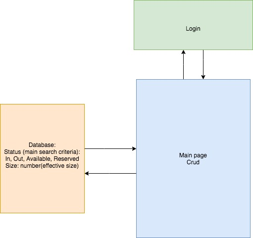

## _Capstone Work Log:_
#### _Friday Febuary 28th_
_Reviewed Ruby lessons and Marios project for areas I should focus on in the creation of my projects code._
_Still studying and beginning to program_
_Add rails project for possible modification_
_Investigate REI website: They appear to use a react frontend so I will try to do the same_
_Found walkthrough for React with API Server: (https://dev.to/jerodimusprime/building-dynamic-react-apps-with-database-data-3apo)_
_Spent Friday evening discussing needs and priorities with employee contact_
_Planning and white-boarding_

#### _Thursday march 5th_
_Began building rails Database_
_spent day building database and setting parameters of objects in Database_
_Current route when running (http://localhost:3000/wetsuits/1)_
_Next steps:
build out parameters
establish basic react views
make call from react to database_

#### _Friday march 6th_
_Began react frontend_
_Functional redux kareoke app informs next steps in calling database_

#### _Monday March 9th_
_Day spent trying to convert Karoeke app into frontend_

#### _Tuesday March 10th_
_Day successfully connected a react-redux frontend application with the Ruby rails Database_

#### _Wednesday March 11th_

# _Capstone REI Rental_

#### _This program allows the user to create, edit and fulfill rental orders_

#### By _**Everett Lee-Wuollet**_

## Description

_This application will allow employees to take customer orders and add them to the database of rental orders. It should have a wide array of options for employees to add and sort by store location._

_The primary goals will be an easy access application that sorts wetsuits by availability (in, out, available or reserved).  It should also have and 'effective size' category for suits which are technically classified as one size, but because of the brand are far close to another.

## Setup/Installation Requirements

* _Access the GitHub repository by copying this (https://github.com/ELee-Wuollet13/Capstone.git) link into a console command to 'git clone [link]'_
* _navigate into the program and enter the console command 'bash startup.bash' this will automatically run 'bundle install, rails db:create, rake db:migrate, rake db:seed and rails s'. As of submission no other setup is required._
* _In your browser go to 'localhost:3000'_
* _click the Navbar links to access the menus_

## Known Bugs

_As of submission this program is incomplete_

## Support and contact details

_If you have any questions comments or concerns please contact me via Email at everett.leewuollet@gmail.com_

## Technologies Used

_This app was made using Ruby on Rails and React_

### License

*Determine the license under which this application can be used.  See below for more details on licensing.*

Copyright (c) 2016 **_Everett Lee-Wuollet_**
